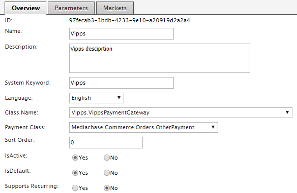
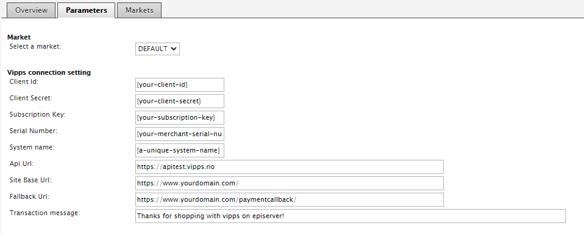

# Vipps for EPiServer

## Description

Vipps payments and Vipps Express Checkout for Episerver Commerce.

## Features
 - Payment gateway for Vipps payments in checkout.
 - Vipps Express Checkout functionality.

## Configuration

### Installation

### Configure Commerce Manager

Login into Commerce Manager and open **Administration -> Order System -> Payments**. Add new payment.

#### Overview tab

- **Name(\*)**
- **System Keyword(\*)** - Vipps(the integration will not work when something else is entered in this field)
- **Language(\*)** - allows a specific language to be specified for the payment gateway
- **Class Name(\*)** - choose **Vipps.VippsPaymentGateway**
- **Payment Class(\*)** - choose **Mediachase.Commerce.Orders.OtherPayment**
- **IsActive** - **Yes**
- **Supports Recurring** - **No** - Vipps recurring payments are not yet supported

(\*) mandatory

- select shipping methods available for this payment



#### Paramaters

 - **Client Id** - Can be obtained through [portal.vipps.no](https://portal.vipps.no)
 - **Client Secret**- Can be obtained through [portal.vipps.no](https://portal.vipps.no)
 - **Subscription Key** - Can be obtained through [portal.vipps.no](https://portal.vipps.no)
 - **Serial number** - Your merchant Serial number, can be obtained through [portal.vipps.no](https://portal.vipps.no)
 - **Api Url** - Vipps API URL (test or prod)
 - **Site Base Url** - The URL for your site (used to generate callback URLs)
 - **Fallback Url** - URL to your fallback controller



### Initialization

In your initialization module you must register the following interfaces
```
services.AddTransient<IVippsService, VippsService>();
services.AddTransient<IVippsPaymentService, VippsPaymentService>();
services.AddTransient<IVippsRequestFactory, DefaultVippsRequestFactory>();
services.AddTransient<IVippsResponseFactory, DefaultVippsResponseFactory>();
services.AddSingleton<IVippsOrderSynchronizer, DefaultVippsOrderSynchronizer>();
services.AddSingleton<IVippsOrderProcessor, DefaultVippsOrderProcessor>();
services.AddSingleton<IVippsPollingService, VippsPollingService>();
```

It is important that IVippsOrderProcessor, IVippsPollingService and IVippsOrderSynchronizer is registered as a singletons.

### Fallback controller

Must be implemented in your project.

The package automatically appends the generated order id as a query string to the specified URL. The quicksilver example implementation can be found [here](demo/Sources/EPiServer.Reference.Commerce.Site/Features/Checkout/Controllers/PaymentFallbackController.cs)

`ProcessAuthorizationAsync` method on `IVippsPaymentService` will return the created purchase order for you if the callback from Vipps was successfull. If not, it will ensure all the correct information is on the payment and shipment objects and then create the purchase order.
**No validation against tempering with the cart line items is done within the package**

```
var result = await _vippsPaymentService.ProcessAuthorizationAsync(currentContactId, currentMarketId, cartName, orderId);
```

The method returns a `ProcessAuthorizationResponse` which contains an enum called `VippsPaymentType`, this can be set to
 - CHECKOUT - Payment was initiated from checkoutpage
 - PRODUCTEXPRESS - Payment was initiated from product page
 - CARTEXPRESS - Payment was initiated from cart page/preview
 - WISHLISTEXPRESS - Payment was initiated from wishlist page/preview
 - UNKOWN - Cart can't be found

This determines where the fallbackcontroller should redirect if `processAuthorizationResult.Processed = false`
Back to checkout, product, wishlist or cart page.

If the payment is processed and the paymenttype is `WISHLISTEXPRESS`, you might also consider finding the customers wishlist cart and deleting it in the fallback controller.

*Note that this only applies to Express payments. If you are only using Vipps in the checkout, VippsPaymentType will always be CHECKOUT and the redirect action will be determined by if the payment succeeded or not.*

The ProcessAuthorizationResponse also contains a possible error message as well as a ProcessResponseErrorType enum.
 - NONE
 - NOCARTFOUND
 - NOVIPPSPAYMENTINCART
 - FAILED
 - ORDERVALIDATIONERROR
 - EXCEPTION
 - OTHER

### Polling

The package includes polling the Vipps API to ensure that the payment is handled, even if user closes the browser tab before redirect and a callback from Vipps is not received.
 - Polling is started when a user is redirected to Vipps.
 - Polling is active for up to ten minutes
 - If a payment has a status that we can act upon polling stops.
 - Set polling interval by adding `Vipps:PollingInterval`  app setting in web config (in milliseconds). Default is 2000 ms.

#### Order validation

No order validation is included in this package to protect from f.ex. cart
tempering. It is **highly** recommended that you implement your own order validation.
Override the `CreatePurchaseOrder` method in the `DefaultVippsOrderProcessor` class.

**Example:** (assuming MyOrderService handles all the order validation)

```
public override async Task < ProcessOrderResponse > CreatePurchaseOrder(ICart cart) {
	try {
		var respone = _myOrderService.CreatePurchaseOrder(cart);

		if (response.Success) {
			return new ProcessOrderResponse {
				PurchaseOrder = response.PurcaseOrder
			};
		}

		return new ProcessOrderResponse {
			ProcessResponseErrorType = ProcessResponseErrorType.ORDERVALIDATIONERROR,
			ErrorMessage = respone.Message
		};
	}
	catch(Exception ex) {
		_logger.Error(ex.Message);
		return new ProcessOrderResponse {
			ErrorMessage = ex.Message,
			ProcessResponseErrorType = ProcessResponseErrorType.EXCEPTION
		};
	}
}
```

## Express payments

### Express payments workflow (Product page)

- User clicks "Vipps Hurtigkasse" button on product page
- A cart with a different cart name then your default cart name is created and product is added to cart (to persist customers original cart)
- A flag with "VippsPaymentType" is saved on cart
- Initiate call to the Vipps API
- User gets redirected to the Vipps landing page and enters their phone number (if using a phone the Vipps app will be automatically opened instead)
- User opens the app
- A call to the shipping details endpoint is made and the available shipping methods and prices are returned
- User chooses shipping method and confirms the payment
- A callback is made to the callback endpoint and the cart is populated with the users information and a PurchaseOrder is created
- User gets redirected to fallback controller

### Express payments workflow (Cart page/review)

- User clicks "Vipps Hurtigkasse" button on product page
- A flag with "VippsPaymentType" is saved on cart
- Initiate call to the Vipps API
- User gets redirected to the Vipps landing page and enters their phone number (if using a phone the Vipps app will be automatically opened instead)
- User opens the app
- A call to the shipping details endpoint is made and the available shipping methods and prices are returned
- User chooses shipping method and confirms the payment
- A callback is made to the callback endpoint and the cart is populated with the users information and a PurchaseOrder is created
- User gets redirected to fallback controller

### Express payments workflow (Wish list page/review)

- User clicks "Vipps Hurtigkasse" button on product page
- The customers WishList cart is loaded
- A cart with a different cart name then your default cart name is created and all products from wishlist are added (to persist customers original/wishlist cart)
- A flag with "VippsPaymentType" is saved on cart
- Initiate call to the Vipps API
- User gets redirected to the Vipps landing page and enters their phone number (if using a phone the Vipps app will be automatically opened instead)
- User opens the app
- A call to the shipping details endpoint is made and the available shipping methods and prices are returned
- User chooses shipping method and confirms the payment
- A callback is made to the callback endpoint and the cart is populated with the users information and a PurchaseOrder is created
- User gets redirected to fallback controller

### Callbacks

The code being run on all callbacks is in `DefaultVippsResponseFactory`, if you need to customize any of this behaviour, just create a new class that inherits from `DefaultVippsResponseFactory`, override the relevant methods and register it in your initialization module as your implementation of `IVippsResponseFactory`.

### Express controller

An API controller for initializing an express checkout is included in the package. This controller contains basic add to cart functionality for express checkout on product pages, but if you want to use your own cart workflow you will need to create your own controller for this.

If you want to use the express checkout in your cart preview, the controller will try and look for a cart named "Default". So if the default cart name for your site is something else, you also need to implement your own controller.

The controller has three methods:
 - GET vippsexpress/cartexpress
 - GET vippsexpress/wishlistexpress
 - POST vippsexpress/productexpress?code={code}&quantity={quantity}

 In return you get a `ExpressCheckoutResponse` with three properties
  - Success
  - ErrorMessage
  - RedirectUrl

 For the simplest possible frontend implementation of this using jQuery and AJAX. See [VippsExpress.js](demo/Sources/EPiServer.Reference.Commerce.Site/Scripts/js/VippsExpress.js) and [Product/Index](/demo/Sources/EPiServer.Reference.Commerce.Site/Views/Product/Index.cshtml)

### Implement your own Express Checkout (Api) Controller

If you need to implement your own version of the Express Checkout Controller, which in a majority of cases would be the recommended route, there are a few things that are important to keep in mind:

**Cart metafield "VippsPaymentType" must be set before processing the payment**
This is how we differentiate express payments from regular checkout payments, as well as how we determine the redirect action in the `ProcessAuthorizationResponse` so the actual processing of the payment will go wrong if this metafield is not set. This metafiled key is located in `VippsConstants.VippsPaymentType` and the avaliable Values in `VippsPaymentType` enum.

**Cart Name**
In the included implementation of Vipps Express on product page, the cart name is "VippsSingleProductCart". This string can be found in `VippsConstants.VippsSingleProductCart`. This is because we don't want to delete the users "Default" cart when using the Express Checkout.
If you're creating your own implementation, the cart name can be anything you choose since it is passed back to us in the callback and fallback urls.

**Clear cart payments before adding a new payment**
It's assumed that a cart only has one Vipps payment associated with it.

**PaymentHelper**
PaymentHelper will help you create and add a Vipps payment to the cart. It has two helpful methods:
 - `PaymentHelper.GetVippsPaymentMethodDto();` will get the `PaymentMethodDto` for Vipps
 - `PaymentHelper.CreateVippsPayent(ICart, Money, PaymentMethodDto);` will return a Vipps `IPayment` you will be able to add to your cart.

## More info

 - [Vipps Developer Resources](https://github.com/vippsas/vipps-developers)
 - [Vipps eCommere API](https://github.com/vippsas/vipps-ecom-api/)
 - [Frequently Asked Questions for Vipps eCommerce API](https://github.com/vippsas/vipps-ecom-api/blob/master/vipps-ecom-api-faq.md)

## Demo site

Either setup a local version of quicksilver (instructions [here](demo/README.md)), or run through [Docker](https://github.com/Geta/package-shared/blob/master/README.md#local-development-set-up)

**Load and display payment**

- [_Vipps.cshtml](/demo/Sources/EPiServer.Reference.Commerce.Site/Views/Payment/_Vipps.cshtml) - display Vipps Payment method
- [_VippsConfirmation.cshtml](/demo/Sources/EPiServer.Reference.Commerce.Site/Views/Shared/_VippsConfirmation.cshtml) - Vipps order confirmation view
- [VippsPaymentMethod.cs](/demo/Sources/EPiServer.Reference.Commerce.Site/Features/Payment/PaymentMethods/VippsPaymentMethod.cs)

**Fallback controller**
Fallback controller can be found [here](demo/Sources/EPiServer.Reference.Commerce.Site/Features/Checkout/Controllers/PaymentFallbackController.cs)

**Product pages**
A form has been added to [product index](/demo/Sources/EPiServer.Reference.Commerce.Site/Views/Product/Index.cshtml#L99) as well as the packages and bundle index.

**Cart preview**
A form has been added to [cart preview](/demo/Sources/EPiServer.Reference.Commerce.Site/Views/Shared/_MiniCartDetails.cshtml#L92)

**WishList page**
A form has been added to [product index](/demo/Sources/EPiServer.Reference.Commerce.Site/Views/WishList/Index.cshtml#L42)

**Frontend for Vipps Express Checkout api call**
Simple jquery/ajax [VippsExpress.js](demo/Sources/EPiServer.Reference.Commerce.Site/Scripts/js/VippsExpress.js)

## Local development environment

In order to use / work on this package locally you'll need a tool called [ngrok](https://www.ngrok.com). This tool can forward a generated ngrok URL to a localhost URL. Both Vipps regular payments as well as express payments are dependant on callbacks from Vipps.

## Checklist

There are some checks you should do before going live, to make sure that a payment can be created in all possible scenarios

 - [ ] FallbackController
  - Set Vipps:PollingInterval in app settings to a high ms count (f.ex. 600000, so polling runs every 10 minutes)
  - Set Site Base Url in Commerce Manager to something that isn't correct
  - Make sure your Fallback Url is correct in Commerce Manager
  - Go through the order flow and comfirm an order has been created
  
  This forces the order to be created when the user is redirected to your fallback controller. (In the ProcessAuthorizationAsync method in VippsPaymentService).
  
  
 - [ ] Callbacks
  - Set Vipps:PollingInterval in app settings to a high ms count (f.ex. 600000, so polling runs every 10 minutes)
  - Set Fallback Url in Commerce Manager to something that isn't correct
  - Make sure your Site Base Url is correct in Commerce Manager (your ngrok generated url if testing locally)
  - Go through the order flow and comfirm an order has been created
  
  This forces the order to be created in the api callback from Vipps.
  
  
  - [ ] Polling
  - Set Vipps:PollingInterval in app settings to what you're need is or remove the app setting (Default value 2000ms)
  - Set Fallback Url in Commerce Manager to something that isn't correct
  - Make sure your Site Base Url is correct in Commerce Manager (your ngrok generated url if testing locally)
  - Go through the order flow and comfirm an order has been created
  
  This forces the order to be created through the built in polling against the Vipps api.

## Changelog

[Changelog](CHANGELOG.md)
